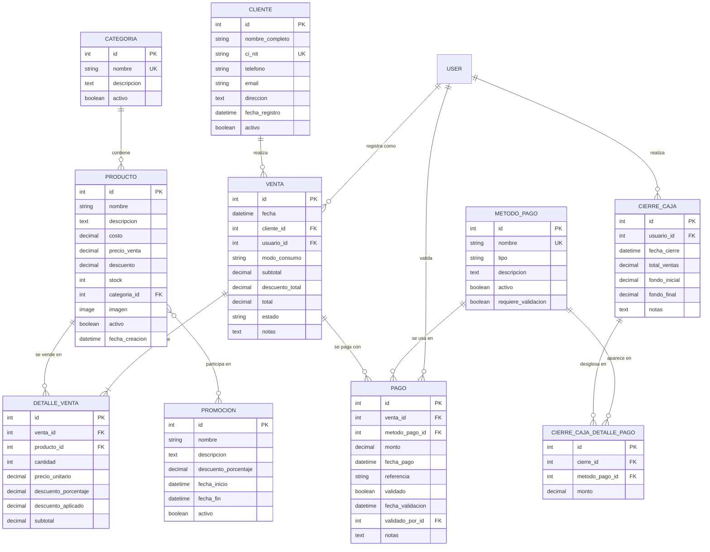

# Informe del Proyecto - Sistema POS Pollos Panchita

**Proyecto:** Sistema de Punto de Venta (POS) para Pollos Panchita  
**Tecnología:** Django 4.2+ | Python 3.x | MySQL 8.0  
**Fecha:** Enero 2026  
**Institución:** Universidad Privada Domingo Savio (UPDS)  
**Materia:** Tecnología Web I

---

## 1. Resumen Ejecutivo

El Sistema POS Pollos Panchita es una aplicación web completa diseñada para gestionar las operaciones diarias de un restaurante de pollos a la brasa. El sistema integra gestión de inventario, procesamiento de ventas, administración de clientes, múltiples métodos de pago, y reportes financieros.

### Características Principales

- **Punto de Venta (POS)** con interfaz intuitiva y rápida
- **Gestión de Inventario** con categorías y control de stock
- **Administración de Clientes** con historial de compras
- **Múltiples Métodos de Pago** (Efectivo, Tarjeta, QR, Transferencia)
- **Sistema de Promociones** con descuentos configurables
- **Cierre de Caja** con desglose por método de pago
- **Reportes y Estadísticas** de ventas y productos
- **Control de Usuarios** con roles (Admin/Cajero)

---

## 2. Arquitectura del Sistema

### 2.1 Stack Tecnológico

| Componente | Tecnología | Versión |
|------------|-----------|---------|
| **Backend** | Django | 4.2+ |
| **Lenguaje** | Python | 3.x |
| **Base de Datos** | MySQL | 8.0 |
| **Conector DB** | PyMySQL | Latest |
| **Frontend** | HTML5, CSS3, JavaScript | - |
| **Framework CSS** | Bootstrap 5 | 5.x |
| **Iconos** | Font Awesome | 6.4.0 |
| **Contenedores** | Docker & Docker Compose | Latest |
| **Servidor Web** | Django Dev Server / Gunicorn | - |

### 2.2 Estructura del Proyecto

```
PanchitaApp/
├── gestion/                    # Aplicación principal
│   ├── models.py              # Modelos de base de datos
│   ├── views.py               # Lógica de negocio
│   ├── urls.py                # Rutas de la aplicación
│   ├── admin.py               # Panel de administración
│   ├── templatetags/          # Filtros personalizados
│   ├── static/gestion/        # Archivos estáticos
│   │   ├── css/              # Estilos CSS
│   │   └── js/               # JavaScript (POS, etc.)
│   └── templates/gestion/     # Plantillas HTML
├── panchita_project/          # Configuración Django
│   ├── settings.py           # Configuración del proyecto
│   ├── urls.py               # URLs principales
│   └── wsgi.py               # WSGI para producción
├── media/                     # Archivos subidos por usuarios
│   └── productos/            # Imágenes de productos
├── docker-compose.yml         # Configuración Docker
├── Dockerfile                 # Imagen Docker
├── requirements.txt           # Dependencias Python
├── init_data.py              # Script de inicialización
└── load_products.py          # Carga de productos
```

---

## 3. Diseño de Base de Datos

### 3.1 Diagrama Entidad-Relación



### 3.2 Descripción de Modelos

#### **Categoria**

Organiza los productos en grupos lógicos (Pollos, Bebidas, Extras, etc.).

**Campos principales:**

- `nombre`: Nombre único de la categoría
- `descripcion`: Descripción opcional
- `activo`: Estado de la categoría

#### **Producto**

Representa los artículos disponibles para la venta.

**Campos principales:**

- `nombre`: Nombre del producto
- `costo`: Costo de producción/compra
- `precio_venta`: Precio al público
- `descuento`: Porcentaje de descuento (0-100)
- `stock`: Cantidad disponible
- `categoria`: Relación con Categoria
- `imagen`: Imagen del producto

**Métodos:**

- `precio_final()`: Calcula precio con descuento
- `margen_ganancia()`: Calcula margen en porcentaje
- `tiene_stock(cantidad)`: Verifica disponibilidad

#### **Cliente**

Almacena información de los clientes del restaurante.

**Campos principales:**

- `nombre_completo`: Nombre del cliente
- `ci_nit`: Documento de identidad único
- `telefono`: Número de contacto
- `email`: Correo electrónico
- `direccion`: Dirección física

**Cliente especial:** "Mostrador" (CI: MOSTRADOR) para ventas rápidas sin cliente específico.

#### **MetodoPago**

Define los métodos de pago aceptados.

**Tipos disponibles:**

- Efectivo
- Tarjeta de Crédito/Débito
- Código QR
- Transferencia Bancaria

**Campos principales:**

- `nombre`: Nombre del método
- `tipo`: Tipo de pago
- `requiere_validacion`: Si necesita confirmación manual

#### **Promocion**

Gestiona descuentos temporales en productos.

**Campos principales:**

- `nombre`: Nombre de la promoción
- `descuento_porcentaje`: Porcentaje de descuento
- `fecha_inicio` / `fecha_fin`: Vigencia
- `productos`: Productos incluidos (ManyToMany)

**Métodos:**

- `esta_vigente()`: Verifica si está activa
- `aplicar_a_producto(producto)`: Aplica descuento

#### **Venta**

Registro de cada transacción de venta.

**Campos principales:**

- `fecha`: Timestamp de la venta
- `cliente`: Cliente que compra
- `usuario`: Vendedor/cajero
- `modo_consumo`: Local o Para llevar
- `subtotal`: Suma de productos
- `descuento_total`: Descuentos aplicados
- `total`: Monto final
- `estado`: Pendiente/Completado/Cancelado

**Métodos:**

- `calcular_totales()`: Recalcula montos
- `tiene_pago_completo()`: Verifica pago total

#### **DetalleVenta**

Líneas individuales de productos en una venta.

**Campos principales:**

- `venta`: Venta asociada
- `producto`: Producto vendido
- `cantidad`: Unidades
- `precio_unitario`: Precio al momento de venta
- `descuento_porcentaje`: Descuento aplicado
- `subtotal`: Total de la línea

**Lógica:** El método `save()` calcula automáticamente descuentos y subtotales.

#### **Pago**

Registra los pagos recibidos por cada venta.

**Campos principales:**

- `venta`: Venta asociada
- `metodo_pago`: Método utilizado
- `monto`: Cantidad pagada
- `referencia`: Número de transacción
- `validado`: Si fue confirmado
- `validado_por`: Usuario que validó

**Métodos:**

- `validar_pago(usuario)`: Confirma el pago

**Validación:** Evita que el total de pagos exceda el total de la venta.

#### **CierreCaja**

Registro del cierre de caja al final del turno.

**Campos principales:**

- `usuario`: Cajero que cierra
- `fecha_cierre`: Timestamp del cierre
- `total_ventas`: Suma de ventas del día
- `fondo_inicial` / `fondo_final`: Efectivo en caja
- `notas`: Observaciones

#### **CierreCajaDetallePago**

Desglose de totales por método de pago en un cierre.

**Campos principales:**

- `cierre`: Cierre asociado
- `metodo_pago`: Método de pago
- `monto`: Total recaudado

**Restricción:** Único por cierre y método de pago.

---

## 4. Funcionalidades del Sistema

### 4.1 Módulo de Punto de Venta (POS)

**Ubicación:** `/pos/`

**Características:**

- Interfaz dividida en dos paneles (carrito y productos)
- Búsqueda y filtrado de productos por categoría
- Selección de cliente o uso de "Venta Mostrador"
- Cálculo automático de totales
- Selección de modo de consumo (Local/Para llevar)
- Procesamiento de pago con múltiples métodos
- Creación rápida de nuevos clientes desde el POS

**Flujo de trabajo:**

1. Seleccionar productos y cantidades
2. Elegir cliente (o usar Mostrador)
3. Revisar orden y modo de consumo
4. Procesar pago
5. Generar venta y actualizar stock

### 4.2 Gestión de Productos

**Ubicación:** `/productos/`

**Operaciones CRUD:**

- Crear nuevo producto con imagen
- Editar información y precios
- Eliminar productos (soft delete)
- Visualizar catálogo completo
- Filtrar por categoría

**Validaciones:**

- Precio de venta > Costo
- Stock no negativo
- Descuento entre 0-100%

### 4.3 Gestión de Clientes

**Ubicación:** `/clientes/`

**Funcionalidades:**

- Registro de nuevos clientes
- Edición de datos de contacto
- Búsqueda por nombre, teléfono o CI
- Historial de compras por cliente
- Desactivación de clientes

### 4.4 Historial de Ventas

**Ubicación:** `/ventas/`

**Características:**

- Listado de todas las ventas
- Filtros por fecha, estado y ticket
- Estadísticas de ventas totales
- Vista detallada de cada venta
- Información de productos, pagos y cliente

### 4.5 Cierre de Caja

**Ubicación:** `/cierre-caja/`

**Proceso:**

1. Visualizar ventas del día
2. Ver desglose por método de pago
3. Registrar fondo inicial y final
4. Agregar notas del turno
5. Confirmar cierre

**Reportes:**

- Historial de cierres anteriores
- Detalle de cada cierre con totales

### 4.6 Reportes

**Ubicación:** `/reportes/` (Solo Admin)

**Métricas disponibles:**

- Total de ventas por período
- Productos más vendidos
- Ingresos por método de pago
- Filtros por rango de fechas

### 4.7 Sistema de Autenticación

**Roles de usuario:**

| Rol | Permisos |
|-----|----------|
| **Admin** | Acceso completo: productos, reportes, configuración |
| **Cajero** | POS, ventas, clientes, cierre de caja |

**Credenciales por defecto:**

- Admin: `admin` / `admin123`
- Vendedor: `vendedor` / `vendedor123`

---

## 5. Configuración y Despliegue

### 5.1 Requisitos del Sistema

- Python 3.8+
- MySQL 8.0+ o SQLite (desarrollo)
- Docker y Docker Compose (opcional)
- 2GB RAM mínimo
- 500MB espacio en disco

### 5.2 Instalación Local

```bash
# 1. Clonar repositorio
git clone <repository-url>
cd PanchitaApp

# 2. Crear entorno virtual
python -m venv .venv
source .venv/bin/activate  # Linux/Mac
.venv\Scripts\activate     # Windows

# 3. Instalar dependencias
pip install -r requirements.txt

# 4. Configurar base de datos (SQLite)
export DJANGO_USE_SQLITE=1  # Linux/Mac
$env:DJANGO_USE_SQLITE="1"  # Windows PowerShell

# 5. Aplicar migraciones
python manage.py migrate

# 6. Cargar datos iniciales
Get-Content init_data.py | python manage.py shell
python load_products.py

# 7. Ejecutar servidor
python manage.py runserver 8080
```

### 5.3 Despliegue con Docker

```bash
# 1. Iniciar contenedores
docker-compose up -d

# 2. Esperar a que MySQL esté listo (30 segundos)

# 3. Aplicar migraciones
docker-compose exec web python manage.py migrate

# 4. Cargar datos
docker-compose exec web sh -c "cat init_data.py | python manage.py shell"
docker-compose exec web python load_products.py

# 5. Acceder a http://localhost:8080
```

**Puertos:**

- Aplicación: `8080`
- MySQL: `3309`
- phpMyAdmin: `8081`

### 5.4 Variables de Entorno

| Variable | Descripción | Valor por Defecto |
|----------|-------------|-------------------|
| `DJANGO_USE_SQLITE` | Usar SQLite en lugar de MySQL | `False` |
| `DB_NAME` | Nombre de la base de datos | `panchita_db` |
| `DB_USER` | Usuario de MySQL | `panchita_user` |
| `DB_PASSWORD` | Contraseña de MySQL | `panchita_pass` |
| `DB_HOST` | Host de MySQL | `localhost` |
| `DB_PORT` | Puerto de MySQL | `3309` |
| `DJANGO_SECRET_KEY` | Clave secreta de Django | (auto-generada) |

---

## 6. Seguridad y Buenas Prácticas

### 6.1 Seguridad Implementada

- **Autenticación requerida:** Todas las vistas protegidas con `@login_required`
- **Protección CSRF:** Tokens en todos los formularios
- **Validación de datos:** Validators en modelos Django
- **Soft delete:** Los registros se desactivan en lugar de eliminarse
- **Protección de relaciones:** `on_delete=PROTECT` en ForeignKeys críticas
- **Validación de pagos:** Evita pagos que excedan el total de venta

### 6.2 Mejoras Futuras Recomendadas

1. **Seguridad:**
   - Implementar HTTPS en producción
   - Agregar autenticación de dos factores
   - Rotación de claves secretas
   - Rate limiting en API

2. **Funcionalidades:**
   - Impresión de tickets en PDF
   - Notificaciones por email/SMS
   - Integración con sistemas de facturación
   - App móvil para pedidos
   - Dashboard con gráficos interactivos

3. **Optimización:**
   - Caché de consultas frecuentes
   - Paginación en listados grandes
   - Compresión de imágenes
   - CDN para archivos estáticos

4. **Monitoreo:**
   - Logs centralizados
   - Alertas de errores
   - Métricas de rendimiento
   - Backup automático de base de datos

---

## 7. Normalización de Base de Datos

### 7.1 Análisis de Formas Normales

**Primera Forma Normal (1FN):** ✅ Cumplida

- Todos los atributos contienen valores atómicos
- No hay grupos repetitivos
- Cada tabla tiene clave primaria

**Segunda Forma Normal (2FN):** ✅ Cumplida

- Cumple 1FN
- Todos los atributos no clave dependen completamente de la clave primaria
- No hay dependencias parciales

**Tercera Forma Normal (3FN):** ✅ Cumplida

- Cumple 2FN
- No hay dependencias transitivas
- Todos los atributos no clave dependen solo de la clave primaria

**Forma Normal de Boyce-Codd (BCNF):** ✅ Cumplida

- Cumple 3FN
- Cada determinante es una clave candidata

### 7.2 Integridad Referencial

**Restricciones implementadas:**

- `PROTECT`: Evita eliminación de registros referenciados (Cliente, Producto, MetodoPago)
- `CASCADE`: Elimina registros dependientes (DetalleVenta, Pago)
- `SET_NULL`: Permite valores nulos en referencias opcionales (validado_por)
- `unique_together`: Evita duplicados en combinaciones (cierre + método de pago)

---

## 8. Pruebas y Validación

### 8.1 Casos de Prueba Realizados

1. **Flujo completo de venta:**
   - Creación de venta con múltiples productos ✅
   - Aplicación de descuentos ✅
   - Pago con múltiples métodos ✅
   - Actualización de stock ✅

2. **Gestión de clientes:**
   - Registro de nuevo cliente ✅
   - Búsqueda por diferentes criterios ✅
   - Cliente "Mostrador" para ventas rápidas ✅

3. **Cierre de caja:**
   - Cálculo de totales por método de pago ✅
   - Registro de cierre con notas ✅
   - Historial de cierres ✅

4. **Validaciones:**
   - Evitar stock negativo ✅
   - Validar montos de pago ✅
   - Verificar descuentos válidos ✅

### 8.2 Datos de Prueba

**Productos cargados:** 16 productos en 6 categorías

- Pollos: 6 productos
- Bebidas: 3 productos
- Mexicana: 4 productos
- Comida Rápida: 2 productos
- Platos: 1 producto

**Usuarios de prueba:**

- Admin (acceso completo)
- Vendedor (acceso limitado)

---

## 9. Conclusiones

El Sistema POS Pollos Panchita es una solución completa y robusta para la gestión de un restaurante de comida rápida. Implementa las mejores prácticas de desarrollo web con Django, incluyendo:

- **Arquitectura MVC** bien estructurada
- **Base de datos normalizada** hasta BCNF
- **Interfaz de usuario intuitiva** con Bootstrap 5
- **Seguridad** mediante autenticación y validaciones
- **Escalabilidad** con Docker y configuración flexible
- **Documentación completa** para mantenimiento

El sistema está listo para producción y puede ser extendido fácilmente con nuevas funcionalidades según las necesidades del negocio.

---

## 10. Referencias

- **Django Documentation:** <https://docs.djangoproject.com/>
- **Bootstrap 5:** <https://getbootstrap.com/>
- **MySQL Documentation:** <https://dev.mysql.com/doc/>
- **Docker Documentation:** <https://docs.docker.com/>

---

**Elaborado por:** Equipo de Desarrollo Pollos Panchita  
**Revisión:** v1.0 - Enero 2026
