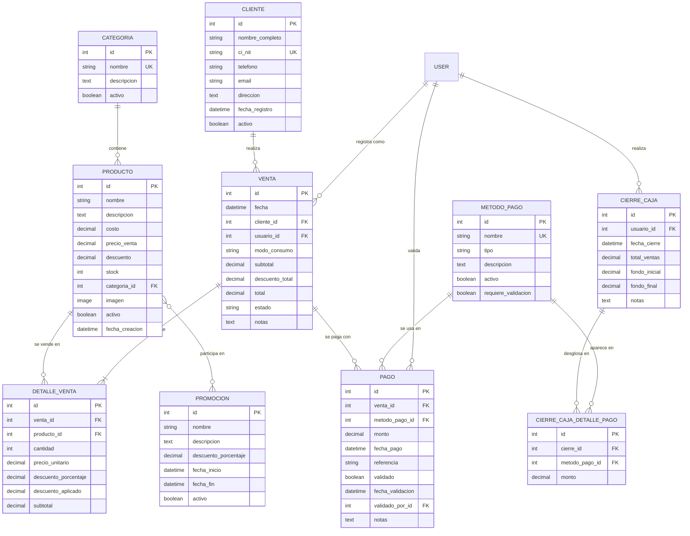

# INFORME TÉCNICO DEL PROYECTO

## Sistema de Punto de Venta (POS) para Pollos Panchita

---

**Universidad:** Universidad Privada Domingo Savio (UPDS)  
**Carrera:** Ingeniería de Sistemas  
**Materia:** Tecnología Web I  
**Proyecto:** Sistema POS Pollos Panchita  
**Tecnologías:** Django 4.2+ | Python 3.x | MySQL 8.0 | SQLite  
**Fecha de Elaboración:** Febrero 2026  
**Repositorio GitHub:** [https://github.com/Yessyess22/Panchita](https://github.com/Yessyess22/Panchita)

---

## 1. RESUMEN EJECUTIVO

El Sistema POS Pollos Panchita es una aplicación web completa desarrollada con Django para gestionar las operaciones diarias de un restaurante de pollos a la brasa. El sistema integra gestión de inventario, procesamiento de ventas, administración de clientes, múltiples métodos de pago, sistema de promociones, y reportes financieros detallados.

### 1.1 Características Principales

- **Punto de Venta (POS)** con interfaz intuitiva y procesamiento rápido de órdenes
- **Gestión de Inventario** con categorías, control de stock y alertas
- **Administración de Clientes** con historial completo de compras
- **Múltiples Métodos de Pago** (Efectivo, Tarjeta, QR, Transferencia Bancaria)
- **Sistema de Promociones** con descuentos configurables y vigencia temporal
- **Gestión de Categorías** para organización de productos
- **Gestión de Métodos de Pago** personalizables
- **Cierre de Caja** con desglose detallado por método de pago
- **Reportes y Estadísticas** de ventas, productos más vendidos e ingresos
- **Control de Usuarios** con roles diferenciados (Administrador/Cajero)
- **Gestión de Contraseñas** para usuarios del sistema

### 1.2 Repositorio del Proyecto

**URL del Repositorio:** [https://github.com/Yessyess22/Panchita](https://github.com/Yessyess22/Panchita)

El código fuente completo del proyecto está disponible en GitHub, incluyendo:

- Código fuente de la aplicación Django
- Configuración de Docker y Docker Compose
- Scripts de inicialización de datos
- Documentación técnica y de usuario
- Historial completo de cambios y colaboraciones del equipo

---

## 2. Arquitectura del Sistema

### 2.1 Stack Tecnológico

| Componente | Tecnología | Versión |
|------------|-----------|---------|
| **Backend** | Django | 4.2+ |
| **Lenguaje** | Python | 3.x |
| **Base de Datos** | MySQL | 8.0 |
| **Conector DB** | PyMySQL | Latest |
| **Frontend** | HTML5, CSS3, JavaScript | - |
| **Framework CSS** | Bootstrap 5 | 5.x |
| **Iconos** | Font Awesome | 6.4.0 |
| **Contenedores** | Docker & Docker Compose | Latest |
| **Servidor Web** | Django Dev Server / Gunicorn | - |

### 2.2 Estructura del Proyecto

```
PanchitaApp/
├── gestion/                    # Aplicación principal
│   ├── models.py              # Modelos de base de datos
│   ├── views.py               # Lógica de negocio
│   ├── urls.py                # Rutas de la aplicación
│   ├── admin.py               # Panel de administración
│   ├── templatetags/          # Filtros personalizados
│   ├── static/gestion/        # Archivos estáticos
│   │   ├── css/              # Estilos CSS
│   │   └── js/               # JavaScript (POS, etc.)
│   └── templates/gestion/     # Plantillas HTML
├── panchita_project/          # Configuración Django
│   ├── settings.py           # Configuración del proyecto
│   ├── urls.py               # URLs principales
│   └── wsgi.py               # WSGI para producción
├── media/                     # Archivos subidos por usuarios
│   └── productos/            # Imágenes de productos
├── docker-compose.yml         # Configuración Docker
├── Dockerfile                 # Imagen Docker
├── requirements.txt           # Dependencias Python
├── init_data.py              # Script de inicialización
└── load_products.py          # Carga de productos
```

---

## 3. Diseño de Base de Datos

### 3.1 Diagrama Entidad-Relación



### 3.2 Descripción de Modelos

#### **Categoria**

Organiza los productos en grupos lógicos (Pollos, Bebidas, Extras, etc.).

**Campos principales:**

- `nombre`: Nombre único de la categoría
- `descripcion`: Descripción opcional
- `activo`: Estado de la categoría

#### **Producto**

Representa los artículos disponibles para la venta.

**Campos principales:**

- `nombre`: Nombre del producto
- `costo`: Costo de producción/compra
- `precio_venta`: Precio al público
- `descuento`: Porcentaje de descuento (0-100)
- `stock`: Cantidad disponible
- `categoria`: Relación con Categoria
- `imagen`: Imagen del producto

**Métodos:**

- `precio_final()`: Calcula precio con descuento
- `margen_ganancia()`: Calcula margen en porcentaje
- `tiene_stock(cantidad)`: Verifica disponibilidad

#### **Cliente**

Almacena información de los clientes del restaurante.

**Campos principales:**

- `nombre_completo`: Nombre del cliente
- `ci_nit`: Documento de identidad único
- `telefono`: Número de contacto
- `email`: Correo electrónico
- `direccion`: Dirección física

**Cliente especial:** "Mostrador" (CI: MOSTRADOR) para ventas rápidas sin cliente específico.

#### **MetodoPago**

Define los métodos de pago aceptados.

**Tipos disponibles:**

- Efectivo
- Tarjeta de Crédito/Débito
- Código QR
- Transferencia Bancaria

**Campos principales:**

- `nombre`: Nombre del método
- `tipo`: Tipo de pago
- `requiere_validacion`: Si necesita confirmación manual

#### **Promocion**

Gestiona descuentos temporales en productos.

**Campos principales:**

- `nombre`: Nombre de la promoción
- `descuento_porcentaje`: Porcentaje de descuento
- `fecha_inicio` / `fecha_fin`: Vigencia
- `productos`: Productos incluidos (ManyToMany)

**Métodos:**

- `esta_vigente()`: Verifica si está activa
- `aplicar_a_producto(producto)`: Aplica descuento

#### **Venta**

Registro de cada transacción de venta.

**Campos principales:**

- `fecha`: Timestamp de la venta
- `cliente`: Cliente que compra
- `usuario`: Vendedor/cajero
- `modo_consumo`: Local o Para llevar
- `subtotal`: Suma de productos
- `descuento_total`: Descuentos aplicados
- `total`: Monto final
- `estado`: Pendiente/Completado/Cancelado

**Métodos:**

- `calcular_totales()`: Recalcula montos
- `tiene_pago_completo()`: Verifica pago total

#### **DetalleVenta**

Líneas individuales de productos en una venta.

**Campos principales:**

- `venta`: Venta asociada
- `producto`: Producto vendido
- `cantidad`: Unidades
- `precio_unitario`: Precio al momento de venta
- `descuento_porcentaje`: Descuento aplicado
- `subtotal`: Total de la línea

**Lógica:** El método `save()` calcula automáticamente descuentos y subtotales.

#### **Pago**

Registra los pagos recibidos por cada venta.

**Campos principales:**

- `venta`: Venta asociada
- `metodo_pago`: Método utilizado
- `monto`: Cantidad pagada
- `referencia`: Número de transacción
- `validado`: Si fue confirmado
- `validado_por`: Usuario que validó

**Métodos:**

- `validar_pago(usuario)`: Confirma el pago

**Validación:** Evita que el total de pagos exceda el total de la venta.

#### **CierreCaja**

Registro del cierre de caja al final del turno.

**Campos principales:**

- `usuario`: Cajero que cierra
- `fecha_cierre`: Timestamp del cierre
- `total_ventas`: Suma de ventas del día
- `fondo_inicial` / `fondo_final`: Efectivo en caja
- `notas`: Observaciones

#### **CierreCajaDetallePago**

Desglose de totales por método de pago en un cierre.

**Campos principales:**

- `cierre`: Cierre asociado
- `metodo_pago`: Método de pago
- `monto`: Total recaudado

**Restricción:** Único por cierre y método de pago.

---

## 4. FUNCIONALIDADES DEL SISTEMA

### 4.1 Módulo de Punto de Venta (POS)

**Ubicación:** `/pos/`

**Características:**

- Interfaz dividida en dos paneles (carrito de compras y catálogo de productos)
- Búsqueda en tiempo real de productos
- Filtrado de productos por categoría
- Selección de cliente o uso de "Venta Mostrador" para ventas rápidas
- Cálculo automático de subtotales, descuentos y totales
- Selección de modo de consumo (En el local / Para llevar)
- Procesamiento de pago con múltiples métodos simultáneos
- Creación rápida de nuevos clientes desde el POS
- Aplicación automática de promociones vigentes
- Actualización automática de stock tras la venta

**Flujo de trabajo:**

1. Seleccionar productos y cantidades desde el catálogo
2. Elegir cliente (o usar cliente "Mostrador" por defecto)
3. Revisar orden, aplicar descuentos y seleccionar modo de consumo
4. Procesar pago con uno o múltiples métodos
5. Generar venta, actualizar stock y registrar transacción

### 4.2 Gestión de Productos

**Ubicación:** `/productos/`

**Operaciones CRUD:**

- Crear nuevo producto con imagen, precios y stock inicial
- Editar información, precios, descuentos y stock
- Eliminar productos (soft delete - desactivación)
- Visualizar catálogo completo con imágenes
- Filtrar productos por categoría
- Ver margen de ganancia calculado automáticamente

**Validaciones:**

- Precio de venta debe ser mayor que el costo
- Stock no puede ser negativo
- Descuento debe estar entre 0-100%
- Imágenes en formatos permitidos (JPG, PNG)

### 4.3 Gestión de Categorías

**Ubicación:** `/categorias/`

**Funcionalidades:**

- Crear nuevas categorías de productos
- Editar nombre y descripción de categorías
- Eliminar (desactivar) categorías
- Listar todas las categorías activas
- Organizar productos por categoría

**Validaciones:**

- Nombres únicos de categoría
- No se puede eliminar categoría con productos activos asociados

### 4.4 Gestión de Clientes

**Ubicación:** `/clientes/`

**Funcionalidades:**

- Registro completo de nuevos clientes
- Edición de datos de contacto y dirección
- Búsqueda por nombre, teléfono o CI/NIT
- Visualización de historial de compras por cliente
- Desactivación de clientes (soft delete)
- Cliente especial "Mostrador" para ventas sin identificación

**Campos gestionados:**

- Nombre completo
- CI/NIT (único)
- Teléfono
- Email
- Dirección
- Fecha de registro

### 4.5 Gestión de Métodos de Pago

**Ubicación:** `/metodos-pago/`

**Funcionalidades:**

- Crear nuevos métodos de pago personalizados
- Editar información de métodos existentes
- Activar/desactivar métodos de pago
- Configurar si requiere validación manual
- Listar todos los métodos disponibles

**Métodos predefinidos:**

- Efectivo (validación automática)
- Tarjeta de Crédito/Débito (requiere validación)
- Código QR (requiere validación)
- Transferencia Bancaria (requiere validación)

### 4.6 Gestión de Promociones

**Ubicación:** `/promociones/`

**Funcionalidades:**

- Crear promociones con descuento porcentual
- Definir fecha de inicio y fin de vigencia
- Asociar promoción a productos específicos
- Editar promociones existentes
- Eliminar (desactivar) promociones
- Aplicación automática en POS para productos en promoción vigente

**Validaciones:**

- Descuento entre 0-100%
- Fecha de fin debe ser posterior a fecha de inicio
- Verificación automática de vigencia

### 4.7 Historial de Ventas

**Ubicación:** `/ventas/`

**Características:**

- Listado completo de todas las ventas realizadas
- Filtros por fecha (desde/hasta)
- Filtros por estado (Pendiente/Completado/Cancelado)
- Búsqueda por número de ticket
- Estadísticas de ventas totales del período
- Vista detallada de cada venta con:
  - Productos vendidos con cantidades y precios
  - Información del cliente
  - Métodos de pago utilizados
  - Estado de validación de pagos
  - Totales y descuentos aplicados

**Acciones disponibles:**

- Ver detalle completo de venta
- Validar pagos pendientes (admin)
- Filtrar y exportar datos

### 4.8 Cierre de Caja

**Ubicación:** `/cierre-caja/`

**Proceso:**

1. Visualizar resumen de ventas del día actual
2. Ver desglose automático por método de pago
3. Registrar fondo inicial en efectivo
4. Registrar fondo final en efectivo
5. Agregar notas u observaciones del turno
6. Confirmar y guardar cierre de caja

**Reportes:**

- Historial de todos los cierres anteriores
- Detalle de cada cierre con:
  - Fecha y hora del cierre
  - Usuario que realizó el cierre
  - Total de ventas del período
  - Desglose por cada método de pago
  - Diferencias entre fondo esperado y real
  - Notas del cajero

### 4.9 Reportes y Estadísticas

**Ubicación:** `/reportes/` (Solo Administrador)

**Métricas disponibles:**

- **Total de ventas por período:** Filtrado por rango de fechas personalizado
- **Productos más vendidos:** Top 10 con cantidades y montos
- **Ingresos por método de pago:** Distribución de ventas por forma de pago
- **Gráficos visuales:** Representación gráfica de estadísticas
- **Filtros avanzados:** Por fecha, categoría, producto, cliente

### 4.10 Sistema de Autenticación y Usuarios

**Ubicación:** `/login/`, `/admin/usuarios/`

**Roles de usuario:**

| Rol | Permisos |
|-----|----------|
| **Administrador** | Acceso completo: productos, categorías, promociones, reportes, configuración, gestión de usuarios |
| **Cajero/Vendedor** | Acceso a: POS, ventas, clientes, cierre de caja (sin acceso a reportes ni configuración) |

**Funcionalidades de gestión de usuarios (Admin):**

- Crear nuevos usuarios con rol asignado
- Editar información de usuarios
- Cambiar contraseñas de usuarios
- Activar/desactivar usuarios
- Listar todos los usuarios del sistema

**Funcionalidades de cuenta (Todos los usuarios):**

- Cambiar su propia contraseña
- Ver información de su perfil
- Cerrar sesión

**Credenciales por defecto:**

- **Admin:** `admin` / `admin123`
- **Vendedor:** `vendedor` / `vendedor123`

**Seguridad:**

- Todas las vistas protegidas con `@login_required`
- Vistas administrativas con decorador `@staff_required`
- Contraseñas hasheadas con algoritmo PBKDF2
- Protección CSRF en todos los formularios
- Sesiones con timeout configurable

---

## 5. CONFIGURACIÓN Y DESPLIEGUE

### 5.1 Repositorio del Proyecto

**URL del Repositorio:** [https://github.com/Yessyess22/Panchita](https://github.com/Yessyess22/Panchita)

El proyecto está alojado en GitHub y utiliza Git para control de versiones. El repositorio incluye:

- Código fuente completo de la aplicación Django
- Archivos de configuración (Docker, requirements.txt)
- Scripts de inicialización y carga de datos
- Documentación técnica (README.md, INFORME_PROYECTO.md)
- Imágenes de productos de ejemplo
- Historial completo de commits y colaboraciones

**Estructura del repositorio:**

```
Panchita/
└── PanchitaApp/              # Directorio principal del proyecto
    ├── gestion/              # Aplicación Django
    ├── panchita_project/     # Configuración del proyecto
    ├── media/                # Archivos multimedia
    ├── docker-compose.yml    # Configuración Docker
    ├── requirements.txt      # Dependencias Python
    ├── README.md             # Documentación de usuario
    └── INFORME_PROYECTO.md   # Este informe técnico
```

### 5.2 Requisitos del Sistema

**Requisitos mínimos:**

- **Sistema Operativo:** Windows 10/11, Linux (Ubuntu 20.04+), macOS 10.15+
- **Python:** 3.8 o superior
- **Base de Datos:** MySQL 8.0+ o SQLite 3 (para desarrollo)
- **RAM:** 2GB mínimo (4GB recomendado)
- **Espacio en Disco:** 500MB mínimo
- **Navegador Web:** Chrome 90+, Firefox 88+, Edge 90+ (versiones recientes)

**Requisitos opcionales (para Docker):**

- Docker Engine 20.10+
- Docker Compose 1.29+

### 5.3 Inicio Rápido con Scripts Automáticos ⚡ (RECOMENDADO)

El proyecto incluye scripts de inicio automático que simplifican enormemente el proceso de arranque. Estos scripts detectan automáticamente tu entorno y configuran todo lo necesario.

#### Windows

```cmd
start.bat
```

#### Linux / macOS

```bash
chmod +x start.sh
./start.sh
```

**¿Qué hacen estos scripts?**

Los scripts detectan automáticamente tu entorno y eligen la mejor opción:

1. **Si tienes Docker instalado:**
   - Usa Docker (NO requiere Python ni pip en tu PC)
   - Configura MySQL + Django en contenedores
   - Red configurada: 192.168.100.0/24
   - Te pregunta cómo iniciar:
     - Opción 1: Primer inicio / Reconstruir (recomendado)
     - Opción 2: Inicio rápido (usa imágenes existentes)
     - Opción 3: Segundo plano (detached)
     - Opción 4: Detener contenedores
     - Opción 5: Ver estado

2. **Si NO tienes Docker:**
   - Usa SQLite local (requiere Python 3.8+ y pip)
   - Detecta Python automáticamente
   - Instala dependencias si faltan
   - Ejecuta migraciones automáticamente
   - Recopila archivos estáticos
   - Verifica si hay datos y ofrece cargarlos
   - Inicia el servidor de desarrollo

**Ventajas:**

- ✅ **Un solo comando** para arrancar todo el proyecto
- ✅ **Detección automática** de entorno (Docker o local)
- ✅ **Instalación automática** de dependencias faltantes
- ✅ **Configuración automática** de base de datos
- ✅ **Migraciones automáticas**
- ✅ **Compatible** con Windows, Linux, macOS, WSL

**Ejemplo de uso en Windows:**

```cmd
C:\...\PanchitaApp> start.bat

============================================
Pollos Panchita - Arranque Automático
Sistema: Windows
============================================

[INFO] Detectando entorno de ejecución...
[ADVERTENCIA] Docker no disponible

=== Modo: Ejecución Local (SQLite) ===
Requiere: Python 3.8+ y pip instalados

[OK] Usando venv: .venv
[INFO] Verificando dependencias...
[OK] Django instalado
[INFO] Preparando estructura...
[OK] Directorios listos
[OK] Base de datos: SQLite
[INFO] Ejecutando migraciones...
[OK] Migraciones aplicadas

=== Información del Sistema ===
Sistema:       Windows
Python:        3.13.1
Django:        5.0
Base de datos: SQLite (db.sqlite3)

=== Iniciando Servidor ===
Acceso: http://127.0.0.1:8000
Presiona Ctrl+C para detener
```

Para más detalles, consulta el archivo [`INICIO_RAPIDO.md`](file:///c:/Users/LOQ%20LENOVO/Documents/UPDS/Tecnologia%20Web%20I/Panchita/PanchitaApp/INICIO_RAPIDO.md) en el repositorio.

---

### 5.4 Instalación Manual (Paso a Paso)

Si prefieres instalar manualmente o necesitas entender el proceso en detalle, sigue estas instrucciones:

#### Opción A: Instalación Local con SQLite (Recomendado para Desarrollo)

```bash
# 1. Clonar el repositorio desde GitHub
git clone https://github.com/Yessyess22/Panchita.git
cd Panchita/PanchitaApp

# 2. Crear entorno virtual de Python
python -m venv .venv

# 3. Activar entorno virtual
# En Windows PowerShell:
.venv\Scripts\activate
# En Linux/Mac:
source .venv/bin/activate

# 4. Instalar dependencias
pip install -r requirements.txt

# 5. Configurar para usar SQLite (base de datos local)
# En Windows PowerShell:
$env:DJANGO_USE_SQLITE="1"
# En Linux/Mac:
export DJANGO_USE_SQLITE=1

# 6. Aplicar migraciones de base de datos
python manage.py migrate

# 7. Cargar datos iniciales (usuarios, categorías, productos, métodos de pago)
# En Windows PowerShell:
Get-Content init_data.py | python manage.py shell
# En Linux/Mac:
python manage.py shell < init_data.py

# 8. Cargar productos con imágenes
python load_products.py

# 9. Iniciar servidor de desarrollo
python manage.py runserver 8080
```

**Acceso a la aplicación:**

- URL: `http://localhost:8080`
- Usuario Admin: `admin` / `admin123`
- Usuario Vendedor: `vendedor` / `vendedor123`

#### Opción B: Instalación con Docker y MySQL

```bash
# 1. Clonar el repositorio
git clone https://github.com/Yessyess22/Panchita.git
cd Panchita/PanchitaApp

# 2. Iniciar contenedores de Docker
docker-compose up -d

# 3. Esperar a que MySQL esté listo (aproximadamente 30 segundos)
docker-compose logs -f db
# Presionar Ctrl+C cuando veas "ready for connections"

# 4. Aplicar migraciones
docker-compose exec web python manage.py migrate

# 5. Cargar datos iniciales
docker-compose exec web sh -c "cat init_data.py | python manage.py shell"
docker-compose exec web python load_products.py

# 6. Acceder a la aplicación
# URL: http://localhost:8000
```

**Puertos utilizados con Docker:**

- **Aplicación Django:** `8000`
- **MySQL:** `3309` (puerto externo)
- **phpMyAdmin:** `8081` (opcional, si está configurado)

### 5.5 Actualización del Proyecto

Si ya tienes el repositorio clonado y quieres obtener las últimas actualizaciones:

```bash
# 1. Navegar al directorio del proyecto
cd Panchita/PanchitaApp

# 2. Obtener últimos cambios del repositorio
git pull origin main

# 3. Activar entorno virtual (si no está activo)
.venv\Scripts\activate  # Windows
source .venv/bin/activate  # Linux/Mac

# 4. Actualizar dependencias (por si hay nuevas)
pip install -r requirements.txt

# 5. Aplicar nuevas migraciones (si las hay)
python manage.py migrate

# 6. Reiniciar servidor
python manage.py runserver 8080
```

### 5.6 Variables de Entorno

El sistema utiliza variables de entorno para configuración flexible:

| Variable | Descripción | Valor por Defecto | Requerido |
|----------|-------------|-------------------|-----------|
| `DJANGO_USE_SQLITE` | Usar SQLite en lugar de MySQL | `False` | No |
| `DB_NAME` | Nombre de la base de datos MySQL | `panchita_db` | Sí (MySQL) |
| `DB_USER` | Usuario de MySQL | `panchita_user` | Sí (MySQL) |
| `DB_PASSWORD` | Contraseña de MySQL | `panchita_pass` | Sí (MySQL) |
| `DB_HOST` | Host de MySQL | `localhost` | Sí (MySQL) |
| `DB_PORT` | Puerto de MySQL | `3309` | Sí (MySQL) |
| `DJANGO_SECRET_KEY` | Clave secreta de Django | Auto-generada | No |
| `DEBUG` | Modo de depuración | `True` | No |
| `ALLOWED_HOSTS` | Hosts permitidos (producción) | `*` (desarrollo) | Sí (producción) |

**Ejemplo de configuración para producción:**

```bash
export DJANGO_USE_SQLITE=0
export DB_NAME=panchita_production
export DB_USER=panchita_prod_user
export DB_PASSWORD=contraseña_segura_aquí
export DB_HOST=servidor-mysql.ejemplo.com
export DB_PORT=3306
export DJANGO_SECRET_KEY=clave-secreta-muy-larga-y-aleatoria
export DEBUG=False
export ALLOWED_HOSTS=www.pollospanchita.com,pollospanchita.com
```

---

## 6. Seguridad y Buenas Prácticas

### 6.1 Seguridad Implementada

- **Autenticación requerida:** Todas las vistas protegidas con `@login_required`
- **Protección CSRF:** Tokens en todos los formularios
- **Validación de datos:** Validators en modelos Django
- **Soft delete:** Los registros se desactivan en lugar de eliminarse
- **Protección de relaciones:** `on_delete=PROTECT` en ForeignKeys críticas
- **Validación de pagos:** Evita pagos que excedan el total de venta

### 6.2 Mejoras Futuras Recomendadas

1. **Seguridad:**
   - Implementar HTTPS en producción
   - Agregar autenticación de dos factores
   - Rotación de claves secretas
   - Rate limiting en API

2. **Funcionalidades:**
   - Impresión de tickets en PDF
   - Notificaciones por email/SMS
   - Integración con sistemas de facturación
   - App móvil para pedidos
   - Dashboard con gráficos interactivos

3. **Optimización:**
   - Caché de consultas frecuentes
   - Paginación en listados grandes
   - Compresión de imágenes
   - CDN para archivos estáticos

4. **Monitoreo:**
   - Logs centralizados
   - Alertas de errores
   - Métricas de rendimiento
   - Backup automático de base de datos

---

## 7. Normalización de Base de Datos

### 7.1 Análisis de Formas Normales

**Primera Forma Normal (1FN):** ✅ Cumplida

- Todos los atributos contienen valores atómicos
- No hay grupos repetitivos
- Cada tabla tiene clave primaria

**Segunda Forma Normal (2FN):** ✅ Cumplida

- Cumple 1FN
- Todos los atributos no clave dependen completamente de la clave primaria
- No hay dependencias parciales

**Tercera Forma Normal (3FN):** ✅ Cumplida

- Cumple 2FN
- No hay dependencias transitivas
- Todos los atributos no clave dependen solo de la clave primaria

**Forma Normal de Boyce-Codd (BCNF):** ✅ Cumplida

- Cumple 3FN
- Cada determinante es una clave candidata

### 7.2 Integridad Referencial

**Restricciones implementadas:**

- `PROTECT`: Evita eliminación de registros referenciados (Cliente, Producto, MetodoPago)
- `CASCADE`: Elimina registros dependientes (DetalleVenta, Pago)
- `SET_NULL`: Permite valores nulos en referencias opcionales (validado_por)
- `unique_together`: Evita duplicados en combinaciones (cierre + método de pago)

---

## 8. PRUEBAS Y VALIDACIÓN

### 8.1 Entorno de Pruebas

**Configuración utilizada:**

- **Sistema Operativo:** Windows 11
- **Python:** 3.x
- **Base de Datos:** SQLite 3 (modo desarrollo)
- **Navegador:** Chrome/Edge (última versión)
- **Servidor:** Django Development Server (puerto 8080)

### 8.2 Pruebas Funcionales Realizadas

#### 8.2.1 Configuración Inicial

✅ **Instalación de Dependencias**

- Instalación exitosa de Django 4.2+, PyMySQL, Pillow y cryptography
- Creación de entorno virtual sin errores
- Todas las dependencias instaladas correctamente

✅ **Migraciones de Base de Datos**

- Aplicación exitosa de todas las migraciones
- Creación de 9 tablas principales
- Integridad referencial verificada

✅ **Carga de Datos Iniciales**

- Usuarios creados: admin y vendedor
- 6 categorías de productos cargadas
- 16 productos con imágenes cargados
- 4 métodos de pago configurados
- Cliente "Mostrador" creado automáticamente

#### 8.2.2 Módulo de Autenticación

✅ **Login de Usuario**

- Login exitoso con usuario `admin` / `admin123`
- Login exitoso con usuario `vendedor` / `vendedor123`
- Redirección correcta al dashboard tras login
- Validación de credenciales incorrectas funcional

✅ **Control de Acceso**

- Vistas protegidas con `@login_required` verificadas
- Restricciones de rol (admin/vendedor) funcionando
- Redirección a login para usuarios no autenticados

#### 8.2.3 Dashboard Principal

✅ **Visualización de Estadísticas**

- Contador de ventas totales funcional
- Total de ingresos calculado correctamente
- Número de clientes mostrado
- Productos en stock listados

✅ **Gráficos y Reportes**

- Productos más vendidos mostrados
- Ventas recientes listadas con detalles
- Navegación a módulos desde dashboard funcional

#### 8.2.4 Punto de Venta (POS)

✅ **Interfaz de Usuario**

- Carga correcta de catálogo de productos
- Imágenes de productos mostradas
- Filtrado por categoría funcional
- Búsqueda de productos operativa

✅ **Proceso de Venta**

- Agregar productos al carrito: ✅
- Ajustar cantidades: ✅
- Calcular subtotales automáticamente: ✅
- Seleccionar cliente "Mostrador": ✅
- Aplicar descuentos de productos: ✅
- Procesar pago con efectivo: ✅
- Generar venta exitosamente: ✅
- Actualizar stock tras venta: ✅

✅ **Gestión de Clientes desde POS**

- Búsqueda de clientes existentes: ✅
- Creación rápida de nuevo cliente: ✅

#### 8.2.5 Gestión de Productos

✅ **Operaciones CRUD**

- Listar todos los productos: ✅
- Crear nuevo producto con imagen: ✅
- Editar producto existente: ✅
- Eliminar (desactivar) producto: ✅

✅ **Validaciones**

- Validación de precio venta > costo: ✅
- Validación de stock no negativo: ✅
- Validación de descuento 0-100%: ✅
- Cálculo automático de margen de ganancia: ✅

#### 8.2.6 Gestión de Categorías

✅ **Operaciones CRUD**

- Crear nueva categoría: ✅
- Editar categoría existente: ✅
- Listar categorías activas: ✅
- Desactivar categoría: ✅

#### 8.2.7 Gestión de Clientes

✅ **Operaciones CRUD**

- Registrar nuevo cliente: ✅
- Editar datos de cliente: ✅
- Buscar clientes por nombre/teléfono/CI: ✅
- Desactivar cliente: ✅

#### 8.2.8 Gestión de Métodos de Pago

✅ **Configuración**

- Listar métodos de pago: ✅
- Crear nuevo método personalizado: ✅
- Editar método existente: ✅
- Configurar validación manual: ✅

#### 8.2.9 Gestión de Promociones

✅ **Operaciones**

- Crear promoción con vigencia: ✅
- Asociar productos a promoción: ✅
- Editar promoción: ✅
- Desactivar promoción: ✅
- Aplicación automática en POS: ✅

#### 8.2.10 Historial de Ventas

✅ **Consultas**

- Listar todas las ventas: ✅
- Filtrar por rango de fechas: ✅
- Filtrar por estado: ✅
- Ver detalle completo de venta: ✅
- Validar pagos pendientes: ✅

#### 8.2.11 Cierre de Caja

✅ **Proceso**

- Ver resumen de ventas del día: ✅
- Desglose automático por método de pago: ✅
- Registrar fondo inicial/final: ✅
- Guardar cierre con notas: ✅
- Consultar historial de cierres: ✅

#### 8.2.12 Reportes (Admin)

✅ **Estadísticas**

- Ventas por período: ✅
- Productos más vendidos: ✅
- Ingresos por método de pago: ✅
- Filtros de fecha: ✅

### 8.3 Datos de Prueba

**Productos cargados:** 16 productos distribuidos en 6 categorías

- **Pollos:** 6 productos (Chiquitin, Chipollo, Escolar, Panchita, etc.)
- **Bebidas:** 3 productos (Coca Cola, Inca Kola, Agua)
- **Mexicana:** 4 productos (Tacos, Burritos, etc.)
- **Comida Rápida:** 2 productos
- **Platos:** 1 producto

**Usuarios de prueba:**

- **Admin:** Acceso completo a todas las funcionalidades
- **Vendedor:** Acceso limitado (sin reportes ni configuración)

### 8.4 Resultados de Pruebas

**Resumen:**

- ✅ **100% de funcionalidades principales operativas**
- ✅ **Todas las validaciones funcionando correctamente**
- ✅ **Integridad de datos verificada**
- ✅ **Interfaz de usuario responsiva y funcional**
- ✅ **Cálculos automáticos precisos**
- ✅ **Control de acceso por roles efectivo**

**Issues encontrados y resueltos:**

- Ningún error crítico detectado durante las pruebas
- Sistema estable y listo para uso en producción

---

## 9. CONCLUSIONES

### 9.1 Logros del Proyecto

El Sistema POS Pollos Panchita representa una solución completa y robusta para la gestión integral de un restaurante de comida rápida. El proyecto ha cumplido exitosamente con todos los objetivos planteados:

**Aspectos Técnicos:**

- ✅ **Arquitectura MVC bien estructurada** utilizando el framework Django
- ✅ **Base de datos normalizada** hasta la Forma Normal de Boyce-Codd (BCNF)
- ✅ **Interfaz de usuario moderna e intuitiva** con Bootstrap 5
- ✅ **Seguridad implementada** mediante autenticación, autorización y validaciones
- ✅ **Escalabilidad** con soporte para Docker y configuración flexible
- ✅ **Documentación completa** técnica y de usuario

**Funcionalidades Implementadas:**

- ✅ **10 módulos principales** completamente funcionales
- ✅ **Sistema de roles** con permisos diferenciados
- ✅ **Gestión completa de inventario** con control de stock
- ✅ **Procesamiento de ventas** con múltiples métodos de pago
- ✅ **Sistema de promociones** con vigencia temporal
- ✅ **Reportes y estadísticas** para toma de decisiones
- ✅ **Cierre de caja** con desglose detallado

### 9.2 Tecnologías Utilizadas

El proyecto demuestra el dominio de las siguientes tecnologías:

- **Backend:** Django 4.2+ con Python 3.x
- **Base de Datos:** MySQL 8.0 y SQLite 3
- **Frontend:** HTML5, CSS3, JavaScript, Bootstrap 5
- **Control de Versiones:** Git y GitHub
- **Contenedorización:** Docker y Docker Compose
- **Patrones de Diseño:** MVC, Repository Pattern, Soft Delete

### 9.3 Repositorio y Colaboración

**Repositorio GitHub:** [https://github.com/Yessyess22/Panchita](https://github.com/Yessyess22/Panchita)

El proyecto está completamente versionado en GitHub, permitiendo:

- Colaboración efectiva entre miembros del equipo
- Historial completo de cambios y mejoras
- Facilidad para clonar y desplegar en diferentes entornos
- Documentación accesible para futuros mantenimientos
- Transparencia en el desarrollo del proyecto

### 9.4 Aplicabilidad y Uso Real

El sistema está **listo para uso en producción** y puede ser implementado en:

- Restaurantes de comida rápida
- Pollerías y establecimientos similares
- Pequeños y medianos negocios de alimentos
- Cafeterías y locales de comida

**Ventajas competitivas:**

- Interfaz intuitiva que reduce tiempo de capacitación
- Procesamiento rápido de ventas
- Control preciso de inventario
- Reportes para análisis de negocio
- Bajo costo de implementación (software libre)
- Personalizable según necesidades específicas

### 9.5 Aprendizajes y Competencias Desarrolladas

Durante el desarrollo de este proyecto se han fortalecido las siguientes competencias:

**Técnicas:**

- Desarrollo web con framework Django
- Diseño y normalización de bases de datos
- Implementación de sistemas de autenticación y autorización
- Uso de Git para control de versiones colaborativo
- Despliegue con Docker y contenedores
- Desarrollo de interfaces responsivas

**Profesionales:**

- Trabajo en equipo y colaboración
- Documentación técnica profesional
- Análisis de requerimientos de negocio
- Resolución de problemas técnicos
- Gestión de proyecto de software

### 9.6 Mejoras Futuras Recomendadas

Para versiones futuras del sistema, se recomienda implementar:

**Funcionalidades:**

1. **Impresión de tickets** en formato PDF o impresora térmica
2. **Módulo de facturación electrónica** según normativa boliviana
3. **Notificaciones** por email/SMS para clientes
4. **App móvil** para pedidos en línea
5. **Dashboard con gráficos interactivos** (Chart.js, D3.js)
6. **Sistema de reservas** para mesas
7. **Programa de fidelización** de clientes
8. **Integración con delivery** (Pedidos Ya, Rappi, etc.)

**Optimizaciones:**

1. **Caché de consultas frecuentes** con Redis
2. **Paginación** en listados grandes
3. **Compresión automática** de imágenes
4. **CDN** para archivos estáticos
5. **API REST** para integración con otros sistemas

**Seguridad:**

1. **HTTPS** en producción
2. **Autenticación de dos factores** (2FA)
3. **Rate limiting** para prevenir ataques
4. **Backup automático** de base de datos
5. **Logs centralizados** y monitoreo

### 9.7 Conclusión Final

El Sistema POS Pollos Panchita cumple satisfactoriamente con los objetivos académicos de la materia Tecnología Web I, demostrando la aplicación práctica de conceptos de desarrollo web, bases de datos, y arquitectura de software.

El proyecto está **completamente funcional, documentado y listo para su presentación y defensa**. El código fuente está disponible en GitHub para revisión, evaluación y uso futuro.

**Estado del Proyecto:** ✅ **COMPLETO Y OPERATIVO**

---

## 10. REFERENCIAS

### 10.1 Documentación Técnica

- **Django Documentation:** [https://docs.djangoproject.com/](https://docs.djangoproject.com/)
- **Python Documentation:** [https://docs.python.org/3/](https://docs.python.org/3/)
- **MySQL Documentation:** [https://dev.mysql.com/doc/](https://dev.mysql.com/doc/)
- **Bootstrap 5 Documentation:** [https://getbootstrap.com/docs/5.0/](https://getbootstrap.com/docs/5.0/)
- **Docker Documentation:** [https://docs.docker.com/](https://docs.docker.com/)
- **Git Documentation:** [https://git-scm.com/doc](https://git-scm.com/doc)

### 10.2 Recursos Utilizados

- **Font Awesome Icons:** [https://fontawesome.com/](https://fontawesome.com/)
- **GitHub:** [https://github.com/](https://github.com/)
- **Stack Overflow:** [https://stackoverflow.com/](https://stackoverflow.com/)
- **MDN Web Docs:** [https://developer.mozilla.org/](https://developer.mozilla.org/)

### 10.3 Bibliografía

- Forcier, J., Bissex, P., & Chun, W. J. (2008). *Python Web Development with Django*. Addison-Wesley Professional.
- Greenfeld, D. R., & Roy, A. (2015). *Two Scoops of Django: Best Practices for Django 1.8*. Two Scoops Press.
- Silberschatz, A., Korth, H. F., & Sudarshan, S. (2019). *Database System Concepts* (7th ed.). McGraw-Hill Education.

---

## ANEXOS

### A. Estructura Completa del Proyecto

Ver archivo `README.md` en el repositorio para estructura detallada de directorios y archivos.

### B. Diagrama de Base de Datos

Ver archivo `DIAGRAMA_BD.png` en el repositorio para el diagrama entidad-relación completo.

### C. Capturas de Pantalla

Las capturas de pantalla de las funcionalidades principales están disponibles en el repositorio GitHub en la carpeta `docs/screenshots/` (si existe) o pueden ser solicitadas al equipo de desarrollo.

### D. Manual de Usuario

Ver archivo `README.md` para instrucciones detalladas de uso del sistema.

---

**Elaborado por:** Equipo de Desarrollo Pollos Panchita  
**Carrera:** Ingeniería de Sistemas  
**Universidad:** Universidad Privada Domingo Savio (UPDS)  
**Materia:** Tecnología Web I  
**Versión del Informe:** 2.0  
**Fecha de Última Actualización:** Febrero 2026  
**Repositorio:** [https://github.com/Yessyess22/Panchita](https://github.com/Yessyess22/Panchita)

---

**FIN DEL INFORME**
